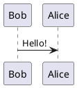

#middle_se #interview #roadmap

## 🎯 Goals
- Understand how Java works internally (JVM, JIT, GC)
- Learn to visualize processes with sequence diagrams
- Write clean, efficient, and maintainable code

## 🧩 Topics
- [x] JVM Architecture ✅ 2025-10-26
- [x] Memory Model (Stack, Heap, Method Area) ✅ 2025-10-26
- [ ] Garbage Collection mechanisms
- [ ] Multithreading & Concurrency
- [ ] Collections Framework (List, Map, Set, Queue)
- [ ] Exception Handling
- [ ] Generics, Streams, Lambda

## 💡 Practice
- [ ] Draw sequence diagrams for “method calls”, “object creation”, “GC”
- [ ] Implement a mini multithreaded program (e.g., producer-consumer)
- [ ] Build small Java console project using OOP best practices [[Month 1  Deep Dive into Java Core]]

## 📘 Resources
- “Effective Java” by Joshua Bloch  
- Java docs on concurrency: https://docs.oracle.com/javase/tutorial/essential/concurrency/

